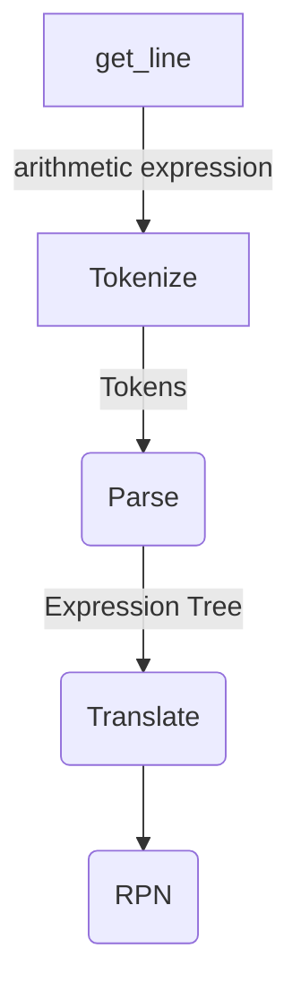

# A Practice of Sum-type in Cpp
I write this calculator application, in which the parsing of arithmetic expression is involved, to learn the sum-type paradigm in modern Cpp.

## Grammar
```
E --> T {( "+" | "-" ) T}
T --> F {( "*" | "/" ) F}
F --> P ["^" F]
P --> v | "(" E ")" | "-" T
```

## Process


## Dependences
* Meson
* fmtlib

## References
* https://www.engr.mun.ca/~theo/Misc/exp_parsing.htm
* https://www.foonathan.net/2022/05/recursive-variant-box/
* https://adriann.github.io/rust_parser.html

